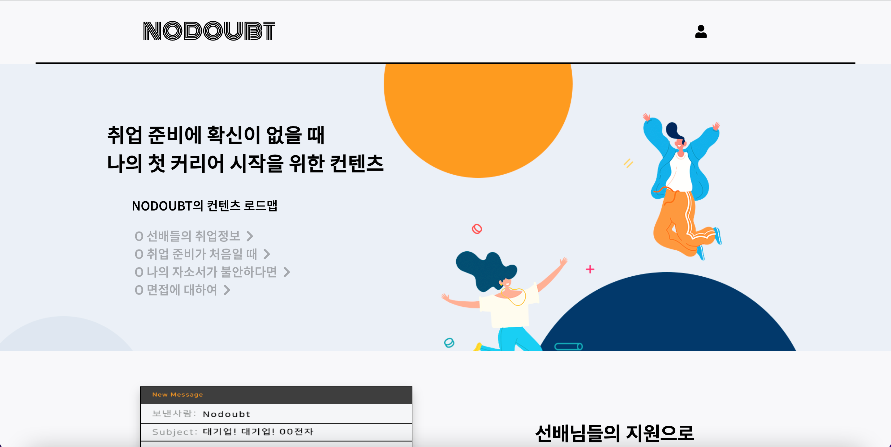
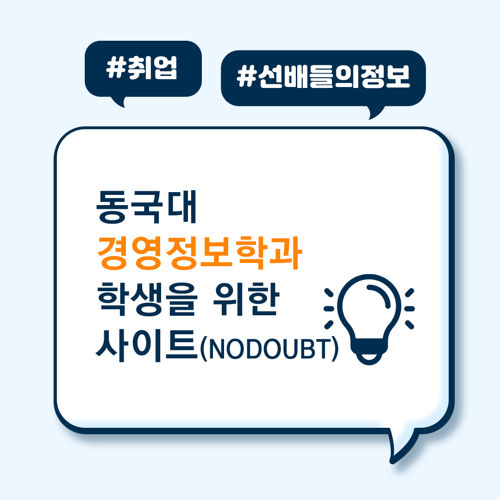
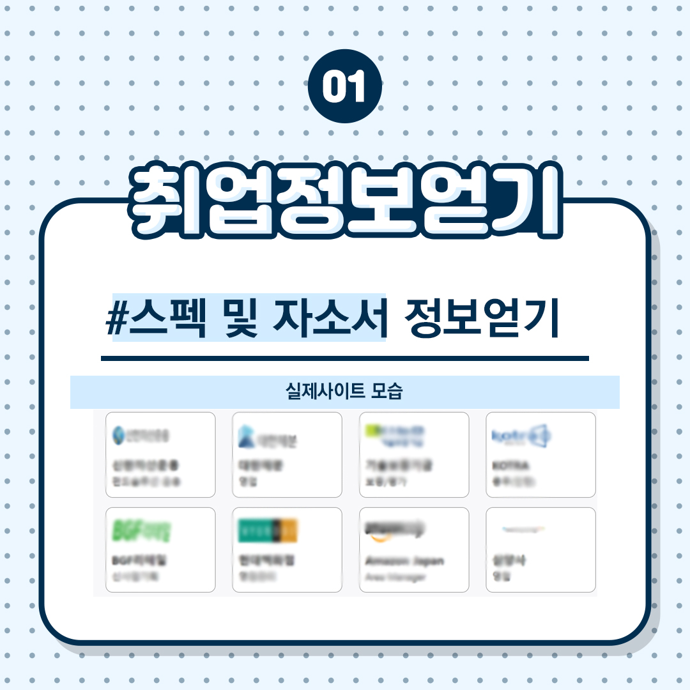
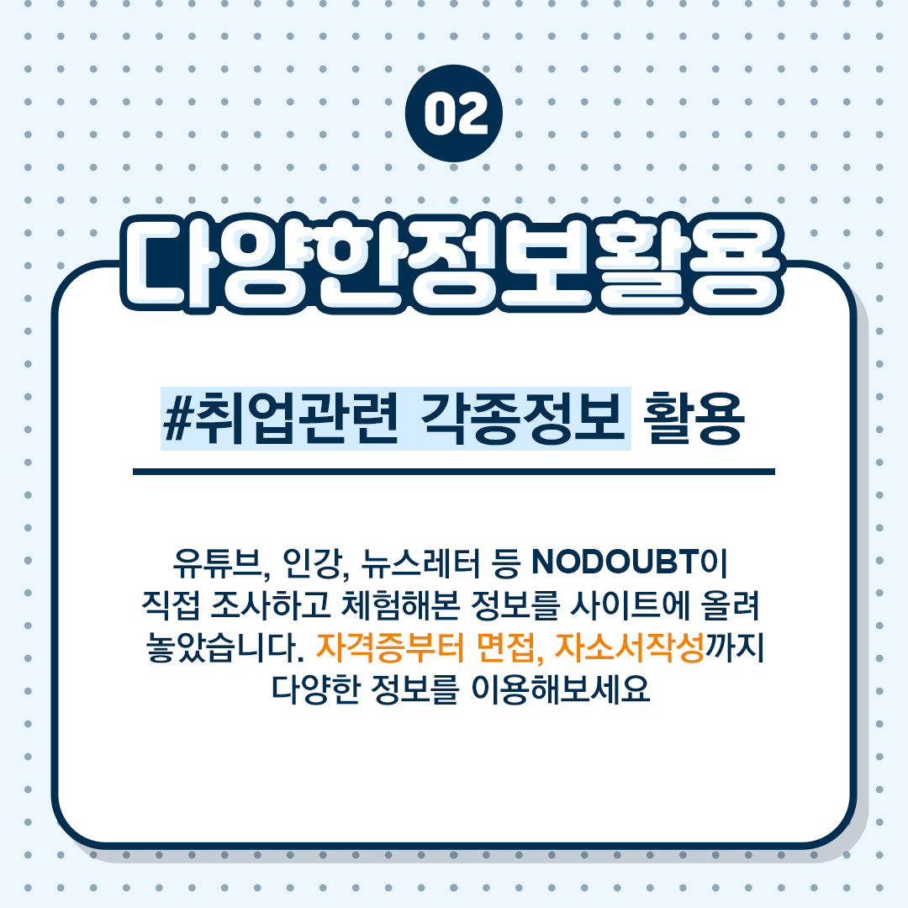

# [NODOUBT] 의심 하지마라! 당신은 취업할 수 있다!

   
  
   

## 프로젝트 소개

    
나와 같은 학교 같은 과 선배들은 어디로 어떻게 취업했을까?

    
진로의 방향성을 잡지 못하거나 원하는 진로를 위해 어떠한 노력을 해야 하는지 등...

    
취업 준비 과정에서 어려움을 느끼는 수 많은 학우들을 보았습니다.

    
'같은 학교 같은 과'라는 유사성을 가진, 선배들의 취업 과정을 제공함으로써

    
조금이나마 취업 준비에 도움을 얻을 수 있는 서비스를 만들고자 하였습니다.

    
    
    
    

## 기술 스택
|    HTML    |    CSS     |    JS    |  Django   |
| :--------: | :--------: | :------: |  :-----:  |
|  </img>   |  </img>    |  </img>   | </img> |
<!-- [html]: readme_imgs/tech_stack/html.svg
[css]: readme_imgs/tech_stack/css.svg
[js]: readme_imgs/tech_stack/javascript.svg
[django]: readme_imgs/tech_stack/django.svg -->

## 구현 기능

### 기능 1 [카테고리 이동]

각 카테고리를 클릭할 시, 해당 카테고리의 내용으로 이동

### 기능 2 [취업 정보 제공하기]

  
  

후배들에게 취업 정보를 제공하기 위해, form 제출

제출된 form 확인 후, 취업 정보 내용 수집 위해 interview 시행

## History
2021/8/24(화) -> 베타 버전 배포 
2021/8/30(월) -> 정식 버전 배포 
2021/9/6(월) -> [NODOUBT] 9월 2주차 자료 전달 완료 & 사이트 운영 방식 변경(공개형) 
2021/9/7(화) -> [특별 공개 자료] 대한제분 공개 
2021/9/10(금) -> [특별 공개 자료] 기술보증기금 공개 
2021/9/13(월) -> [NODOUBT] 9월 3주차 자료 전달 완료 & [특별 공개 자료] KOICA 공개 
2021/9/15(수) -> [특별 공개 자료] 신한자산운용 공개 
2021/9/18(토) -> [NODOUBT] 9월 3주차 자료 전달 완료 & [특별 공개 자료] BGF리테일 공개 
2021/9/23(목) -> [NODOUBT] 9월 4주차 자료 전달 완료 & [특별 공개 자료] 현대백화점 공개 
2021/9/29(수) -> [특별 공개 자료] Amazon Japan 공개 
2021/10/1(금) -> [특별 공개 자료] 오뚜기 공개 
2021/10/4(월) -> [NODOUBT] 10월 1주차 자료 전달 완료 
2021/10/6(수) -> [특별 공개 자료] 대림건설 공개 
2021/10/11(월) -> [NODOUBT] 10월 2주차 자료 전달 완료 & [특별 공개 자료] 익스플즌 공개 